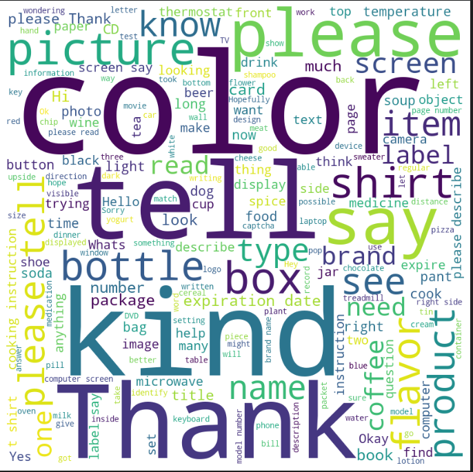
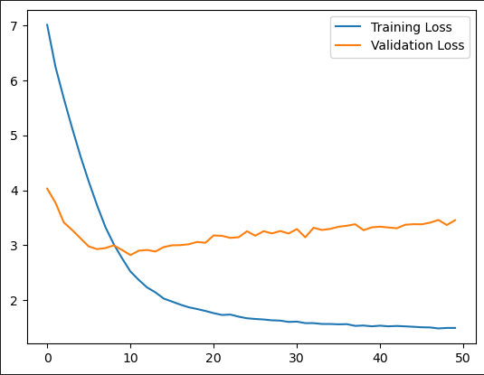

# Visual Question Answering
Welcome to our Visual Question Answering project! Our goal is to create an intelligent system that can answer questions about images to win the [VizWiz grand challenge](https://vizwiz.org/tasks-and-datasets/vqa/), using state-of-the-art deep learning techniques. With our approach, we aim to push the boundaries of what's possible in computer vision and natural language processing. Our dataset is carefully curated and preprocessed to ensure the best possible performance of our model. We've also created a user-friendly web application that allows you to interact with our system and see its capabilities in action. Whether you're a researcher, a developer, or just curious about the latest advances in AI, we invite you to explore our project and learn more about it.

**Note:** We have an official submission for [VizWiz VQA challenge](https://vizwiz.org/tasks-and-datasets/vqa/) where we ranked 4th with an accuracy of 54%. Our team "AFK" is on the [leaderboard](https://eval.ai/web/challenges/challenge-page/1911/leaderboard/4517) for the challenge. We are also ranked 2nd for the answerability score in the [leaderboard](https://eval.ai/web/challenges/challenge-page/1911/leaderboard/4520)

<p align="center">
  
</p>

## Table of Contents
- [Visual Question Answering](#visual-question-answering)
  - [Our Approach](#our-approach)
  - [Dataset](#dataset)
    - [Data Exploration](#data-exploration)
    - [Data Splitting](#data-splitting)
    - [Data Preprocessing](#data-preprocessing)
  - [Model Architecture](#model-architecture)
  - [Training](#training)
    - [Loss Graphs](#loss-graphs)
    - [Accuracy Graphs](#accuracy-graphs)
  - [Evaluation](#evaluation)
    - [Results](#results)
  - [Web Application](#web-application)
    - [User Interface](#user-interface)
  - [Deployment](#deployment)
    - [Using Docker](#using-docker)
    - [Using Python](#using-python)
  - [Contributors](#contributors)
  - [References](#references)

## Our Approach
Our Visual Question Answering (VQA) solution is implemented using a fixed vocabulary approach. This means that the model is not generative, but rather selects the answer from a pre-defined set of possible answers which is discussed in the [Less is More research](https://arxiv.org/abs/2206.05281). This approach is more suitable for our use case, as it allows us to control the vocabulary and ensure that the model only outputs answers that are relevant to the question. In addition to that, it requires a lot less computing power than any other solution. We use the [CLIP](https://openai.com/blog/clip/) model to extract features from the image and the question, and then feed them into a linear layer to predict the answer. We use the [VizWiz](https://vizwiz.org/tasks-and-datasets/vqa/) dataset for training and evaluation. We use the [PyTorch](https://pytorch.org/) library for building and training the model. We have also used [Flask](https://flask.palletsprojects.com/en/2.3.x/) to create a web application that allows you to interact with our model and see its capabilities in action. The web application is deployed using [Docker](https://www.docker.com/).

## Dataset
For this project, we used the [VizWiz](https://vizwiz.org/tasks-and-datasets/vqa/) dataset. It is a large-scale visual question answering dataset that contains 
- 20,523 training image/question pairs
- 205,230 training answer/answer confidence pairs
- 4,319 validation image/question pairs
- 43,190 validation answer/answer confidence pairs
- 8,000 test image/question pairs

Dataset files are as follows:
- Images: training, validation, and test sets
- Annotations: Visual questions are split into three JSON files: train, validation, and test. Answers are publicly shared for the train and validation splits and hidden for the test split.

- The dataset is available on [Kaggle](https://www.kaggle.com/datasets/lhanhsin/vizwiz)

### Data Exploration
We performed extensive exploratory data analysis in the [notebook file](https://github.com/yousefkotp/Visual-Question-Answering/blob/main/notebook.ipynb), so it is advisable to see the notebook first. However, here is an overview for words in the training dataset questions.

<p align="center">
  
</p>

### Data Splitting
For the training and validation sets, we used the official splits provided by the VizWiz dataset. For the test set, we selected 0.05 of the training set randomly to be used as the test set. We used the [train_test_split](https://scikit-learn.org/stable/modules/generated/sklearn.model_selection.train_test_split.html) function from the [scikit-learn](https://scikit-learn.org/stable/) library to split the data.

### Data Preprocessing
According to the paper we are implementing, we will have a policy to choose the most suitable answer out of the 10 answers to train the model on that answer, the policy for building a vocabulary is as follows:

1- Choose the most frequent answer out of the 10 answers

2- If there is a tie, we will choose the most frequent one in the entire set of all answers

3- If there is a tie, we will choose the answer with the minimum Levenshtein distance to all tied answers

We also need to one hot encode the answers, so we will have a vector of size 5410, where 5410 is the size of the vocabulary. We will use the [One Hot Encoder](https://scikit-learn.org/stable/modules/generated/sklearn.preprocessing.OneHotEncoder.html) from the [scikit-learn](https://scikit-learn.org/stable/) library to one hot encode the answers and answer type.

Instead of using lazy processing and extracting question and answer embeddings on the fly, we will extract them beforehand and save them in a pickle file. We will use the [CLIP](https://openai.com/blog/clip/) model to extract the image and questions embeddings.

## Model Architecture
We will follow the architecture mentioned in [Less Is More](https://arxiv.org/abs/2206.05281) paper. The architecture goes as follows:

- Each Linear layer consist of Layer Norm followed by Drop out with probability of 0.5 followed by fully connected layer of size 512.
- We will have Cross Entropy Loss for answer and answer type
- We will use Binary Cross Entropy Loss for answerability

Here is the illustration of the model architecture

<p align="center">
  
</p>

- **Note:** We removed the drop out from answerability linear layer as it was causing a lot of noise in training answerability.

## Training
We have trained the model on Kaggle using P100 cuda accelerator for a total of 50 epoch and picked the best one, each epoch took ~1 minute to finish. We have used a batch size of 32 (64 was bad in terms of variance), we used Adam optimized with a learning rate of 5e-4. No L2 regularization was used. The model was saved after each 5 epochs and the best model was picked based on the validation accuracy. We used the [PyTorch](https://pytorch.org/) library for building and training the model. 

The best model was recorded at epoch 45 so, we will use that model for evaluation. 

### Loss Graphs

<p align="center">
  
</p>

### Accuracy Graphs

<p align="center">
  
</p>

## Evaluation
According to evaluation in [VizWiz VQA Challenge](https://vizwiz.org/tasks-and-datasets/vqa/), we will use the following metrics to evaluate our model:
- **VizWiz Accuracy:** Given an image and question about it, the task is to predict an accurate answer. Inspired by the VQA challenge, we use the following accuracy evaluation metric:

<p align="center">
  
</p>
VizWiz accuracy metric is the minimum between 1 and the number of humans that provided that answer divided by 3.

- **Answerability**: given an image and question about it, the task is to predict if the visual question cannot be answered (with a confidence score in that prediction). The confidence score provided by a prediction model is for ‘answerable’ and should be in [0,1]. We use [Python’s average precision evaluation metric](https://scikit-learn.org/stable/modules/generated/sklearn.metrics.average_precision_score.html) which computes the weighted mean of precisions under a precision-recall curve.

### Results

<table align="center">
    <tr>
        <th>Metrics</th>
        <th>Training</th>
        <th>Validation</th>
    </tr>
  <tr>
    <td>VizWiz Accuracy</td>
    <td>80.4%</td>
    <td>61.5%</td>
  </tr>
  <tr>
    <td>Accuracy</td>
    <td>76.4%</td>
    <td>48.0%</td>
  </tr>
  <tr>
    <td>Answerability</td>
    <td>80.2%</td>
    <td>79.8%</td>
  </tr>
</table>

## Web Application
[Flask](https://flask.palletsprojects.com/en/2.3.x/) is a lightweight web application framework. It is designed to make getting started quick and easy, with the ability to scale up to complex applications. We used Flask to build a web application that allows users to upload an image or enter image url and ask a question about the image. The application will then display the image and the answer to the question in a user friendly way.

### User Interface

<p align="center">
  
</p>

## Deployment
To ease the process of running the application, we have provided two options for deployment: using Docker or using Python. We recommend using Docker, as it is easier to set up and run. However, if you prefer to use Python, you can follow the instructions below. However, you need to place the trained model in the `Saved_Models` folder with the name `model.pth`

### Using Docker
1- Make sure to install [Docker](https://www.docker.com/) on your machine.

2- Run the following command to build the Docker image

```bash
docker build -t vqa-flask-app .
```

3- Run the following command to start the server

```bash
docker run -p 5000:5000 vqa-flask-app
```

- You can change the port number of the deployed application by changing the first number in the command above.

4- Open your browser and go to http://localhost:5000/


### Using Python

1- Make sure to install the requirements

```bash
pip install -r requirements.txt
```

2- Set up the application for the flask

```bash
set FLASK_APP=app.py
```

- If your are using Linux or Mac OS, use the following command instead

```bash
export FLASK_APP=app.py
```

3- Run the following command to start the server

```bash
python -m flask run
```

4- Open your browser and go to http://localhost:5000/

## Contributors

- [Yousef Kotp](https://github.com/yousefkotp)

- [Adham Mohamed](https://github.com/adhammohamed1)

- [Mohamed Farid](https://github.com/MohamedFarid612)

## References

- [Less Is More: Linear Layers on CLIP Features as Powerful VizWiz Model](https://arxiv.org/abs/2206.05281)

- [CLIP: Connecting text and images](https://openai.com/research/clip)

- [Learning Transferable Visual Models From Natural Language Supervision](https://arxiv.org/abs/2103.00020)
